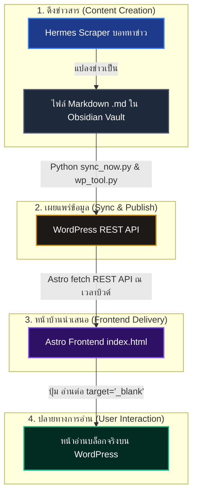

# สรุปโครงสร้างระบบและกระบวนการทำงานของโปรเจกต์ (Watchara School Headless CMS)

เอกสารนี้สรุปเครื่องมือ สถาปัตยกรรม และกระบวนการทำงานแบบเชื่อมโยงข้อมูลหลายมิติ (Headless CMS Pipeline) ของเว็บโรงเรียนวัชระ (Watchara School) ที่ได้ร่วมกันพัฒนาและปรับปรุงมาจนถึงปัจจุบัน

---

## 🛠️ 1. เทคโนโลยีและเครื่องมือที่ใช้งาน (Tech Stack)

โปรเจกต์นี้เป็นการนำจุดเด่นของเทคโนโลยีสมัยใหม่มาผสานเข้าด้วยกัน เพื่อให้ระบบโหลดได้รวดเร็ว (Ultra-fast Loading), ดูพรีเมียม และจัดการข้อมูลได้ง่าย:

1. **Frontend Framework: Astro (v4.16.0)**
   - ทำหน้าที่เรนเดอร์หน้าเว็บแบบ Static Site Generation (SSG) ที่มีประสิทธิภาพสูง โหลดเร็วกว่าสถาปัตยกรรมหน้าเดียวแบบเดิม
2. **Styling: Tailwind CSS (v3.4.19)**
   - ใช้ในการออกแบบระบบ UI ในหน้าเดี่ยวให้สวยงาม หรูหรา สไตล์ Ultra-Premium (Futuristic School) ด้วยเอฟเฟกต์ Glassmorphism, แอนิเมชันลอยแบบกลมกลืน (Float) และโหมดมืด (Dark Mode)
3. **Headless CMS: WordPress REST API**
   - ใช้ WordPress (`https://wordpress.blayblay.com`) เป็นแดชบอร์ดหลังบ้าน (Backend CMS) ในการป้อนข้อมูลข่าวสาร เพื่อให้ผู้ดูแลระบบพิมพ์และโพสต์ได้สะดวก
4. **Staging & Local Backups: Obsidian Vault (.md)**
   - ใช้เป็นฐานข้อมูลข่าวสารในเครื่องระดับไฟล์แบบ Markdown เพื่อความสะดวกในการสร้างไฟล์ข่าวสำรองหรือร่างบทความ (Draft)
5. **Automation Pipeline: Python (v3)**
   - สคริปต์อัตโนมัติในการรวบรวมข่าวสารจากบอท Hermes Scraper และจัดการระบบซิงค์สองทาง (Two-Way Sync)

### 📦 แอปพลิเคชันและเครื่องมือที่ติดตั้ง (Installed Applications & Dependencies)

ระบบได้รับการติดตั้งเครื่องมือและการพึ่งพาโมดูลที่สำคัญต่างๆ ทั้งฝั่ง Node.js และ Python ดังนี้:

* **แอปพลิเคชันระบบหลัก (System Core Applications)**
  - **Node.js (v18+) & NPM** — สำหรับรัน Dev Server และคอมไพล์บิวด์ของหน้า Astro
  - **Python 3.10+** — สำหรับประมวลผลระบบสแครปเปอร์ข่าวสารและระบบซิงค์สองทาง
  - **Obsidian** — สำหรับตกแต่ง จัดระเบียบเนื้อหา Markdown ในเครื่องฝั่งผู้พัฒนา
  - **WordPress** — ระบบโฮสต์ CMS หลักในการจัดเก็บบทความออนไลน์

* **ไลบรารีของ Node.js (Astro & UI dependencies ใน package.json)**
  - `astro` — เฟรมเวิร์กหน้าบ้านหลัก
  - `tailwindcss` — ไลบรารีสำหรับจัดแต่งดีไซน์
  - `@astrojs/tailwind` — ปลั๊กอินเชื่อมผสาน Tailwind เข้ากับสถาปัตยกรรมคอมโพเนนต์ของ Astro

* **ไลบรารีของ Python (โมดูลอัตโนมัติใน requirements.txt)**
  - `requests` — จัดการการเรียกใช้และยิง WordPress REST API
  - `python-dotenv` — โหลดตัวแปรสภาพแวดล้อมสำคัญเช่นข้อมูลความปลอดภัย `.env`
  - `crewai` — เฟรมเวิร์ก AI Agent ในการดึงข่าวสารและตรวจทานอัปโหลดอัตโนมัติ
  - `beautifulsoup4` — ใช้ในการช่วยสกัด HTML จากหน้าข่าวต้นทาง
  - `langchain-google-genai` & `litellm` — จัดการและประมวลผลชุด AI ของโมเดลในไปป์ไลน์

---

## 🔄 2. กระบวนการทำงานของระบบ (System Pipeline Flow)

การทำงานถูกแบ่งออกเป็น 4 ขั้นตอนหลักที่ไหลลื่นเป็นเส้นตรง ตั้งแต่การหาข่าวไปจนถึงหน้าจอผู้ใช้งาน:

1. **การค้นหาและจัดเตรียมข่าวสาร**: บอท Hermes สแครปข่าวสารจากแหล่งข้อมูลต่าง ๆ แล้วแปลงเป็นหน้าโครงร่าง Markdown บันทึกในเครื่อง (`Obsidian_Vault`)
2. **การซิงค์อัปโหลดสองทาง**: สคริปต์ Python ทำหน้าที่ตรวจเช็กไฟล์ `.md` นำเนื้อหาเหล่านั้นส่งอัปโหลดขึ้นบล็อกออนไลน์บน WordPress ผ่าน REST API และจัดการล้างประวัติไฟล์ที่ถูกลบเพื่อให้ฐานข้อมูลมีความตรงกันเสมอ
3. **การดึงข้อมูลแสดงผลหน้านำเสนอ**: ทุกครั้งที่บิวด์เว็บ Astro จะทำการ `fetch` ข้อมูลสดใหม่ตรงจาก API ของ WordPress มาลูปเรนเดอร์ สร้างเป็นการ์ดข่าวสารพรีเมียมตามแต่ละหมวดหมู่โดยอัตโนมัติ
4. **การอ่านข่าวสารอย่างเต็มรูปแบบ**: เมื่อผู้ใช้งานคลิกปุ่ม **"อ่านต่อ"** หรือ **"อ่านเพิ่มเติม"** ที่อยู่บนการ์ดข่าวสาร หน้าเว็บจะเปิดไปยังบทความฉบับเต็มบนบล็อกของ WordPress โดยตรงในแท็บใหม่ทันที

---

## ⚡ 3. สรุปฟังก์ชันเด่นที่พวกเราได้แก้ไขและอัปเกรดเรียบร้อยแล้ว

จากการร่วมมือกันปรับปรุงโค้ด มีการแก้ไขจุดสำคัญต่าง ๆ ดังนี้:

| ฟีเจอร์ที่ได้รับการอัปเกรด | รายละเอียดการเปลี่ยนแปลงทางเทคนิค |
| :--- | :--- |
| **WordPress Native Integration** | เปลี่ยนระบบการดึงข้อมูลจากเดิมที่เคยใช้วิธีอ่านโฟลเดอร์ไฟล์ Markdown โลคอล (`getCollection`) มาใช้การเชื่อมโยงตรงสู่ **WordPress REST API** ทำให้หน้าเว็บบอทซิงค์และอัปเดตแบบเรียลไทม์ผ่านอินเทอร์เน็ตได้โดยตรง |
| **Rich HTML Rendering** | รองรับการนำเข้าแท็ก HTML ต่าง ๆ จาก WordPress เช่น รูปภาพ ย่อหน้า และตัวหนา โดยครอบแท็กดึงผลลัพธ์ผ่านคำสั่ง `
` ทำให้รูปภาพหรือย่อหน้าไม่โชว์ออกมาเป็นตัวอักษรรหัส HTML ดิบ |
| **Premium `.wp-content` Styling** | ออกแบบชุด CSS ปรับแต่งเฉพาะสำหรับข้อมูล WordPress ในสไตล์ชีท ให้รองรับการจัดวางรูปภาพแบบขอบมนสวยงาม ตัวหนาแบบเนทีฟ และระยะห่างย่อหน้าที่ดูสบายตาสอดรับกับโหมดมืด (Dark Mode) |
| **New-Tab Redirection** | อัปเกรดปุ่มอ่านต่อ (Read More) บนหน้าการ์ดข่าวและกล่อง Spotlight ให้เปลี่ยนมาดึงค่าจากฟิลด์ `post.link` โดยตรงของ WordPress พร้อมใส่แท็ก `target="_blank"` และ `rel="noopener noreferrer"` เพื่อความปลอดภัยระดับสากล |
| **Code Cleanup & Refactoring** | ล้างระบบไฟล์ดั้งเดิมและนำเข้าตัวแปรที่ไม่จำเป็นออกทั้งหมด รวมถึงทำความสะอาดพวกโค้ดแปลงไฟล์ `.md` เก่าที่ไม่ได้ถูกเรียกใช้งานแล้ว ทำให้โปรเจกต์น้ำหนักเบาและคอมไพล์ผ่านบิวด์ได้ใน 2-3 วินาที |
