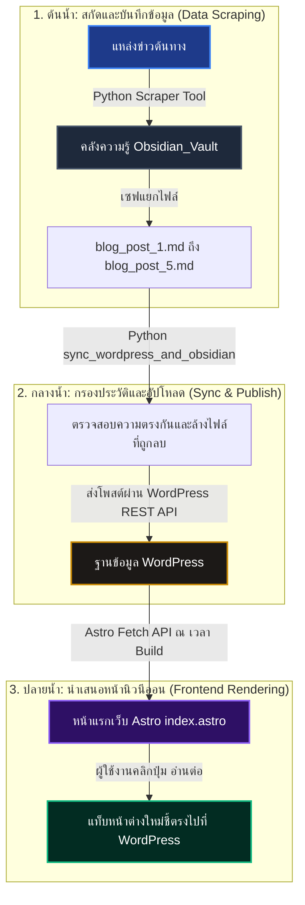

# 📋 สรุปคู่มือกระบวนการทำงานและการติดตั้งระบบ Hermes AI Agent (Watchara School Headless CMS)

เอกสารฉบับนี้เป็นคู่มือสรุปกระบวนการทำงานตั้งแต่เริ่มต้นจนถึงระบบรันเสร็จสมบูรณ์ แบบเป็นขั้นตอน (Step-by-Step) เพื่อให้ผู้เริ่มต้นและทีมงานเข้าใจเทคโนโลยี แอปพลิเคชัน การติดตั้ง การเชื่อมโยงข้อมูล และแหล่งที่มาของ API ทั้งหมดของโปรเจกต์นี้

---

## 🛠️ 1. เทคโนโลยีที่ใช้ทั้งหมดในระบบ (Technology Stack)

ระบบนี้ใช้สถาปัตยกรรมแบบ **Headless CMS** ที่ผสานการทำงานระหว่าง AI Agent เข้ากับระบบจัดเก็บข้อมูล ท่อส่งข้อมูล และหน้าเว็บแสดงผลระดับพรีเมียม:

1. **Frontend (หน้าบ้าน)**:
   * **Astro (v4.16.0)**: เฟรมเวิร์กเว็บความเร็วสูง (SSG - Static Site Generation) ช่วยให้โหลดหน้าแรกของโรงเรียนได้เร็วระดับสายฟ้าแลบ
   * **Tailwind CSS (v3.4.19)**: ใช้จัดแต่งดีไซน์แนว **Futuristic Dark Mode** ตกแต่งสไตล์นีออนเรืองแสง สะดุดตา และใช้ระบบ Glassmorphism ดูพรีเมียม
2. **Database & Knowledge Base (ฐานข้อมูลและการร่างเนื้อหา)**:
   * **Obsidian (.md)**: จัดเก็บสรุปความรู้และร่างข่าวดิบในคอมพิวเตอร์ด้วยรูปแบบไฟล์ Markdown ปลอดภัยและแก้ไขง่าย
3. **Backend / CMS (ระบบหลังบ้านสำหรับประชาสัมพันธ์)**:
   * **WordPress (WordPress REST API)**: ทำหน้าที่เป็น Headless CMS ให้ผู้เขียนข่าวเพิ่ม แก้ไข หรือลบข่าวผ่านหน้าแดชบอร์ด แล้วส่งผ่าน API ไปยังหน้าเว็บ
4. **AI & Automation Pipeline (สมองกลและระบบอัตโนมัติ)**:
   * **Python (v3)**: สคริปต์ควบคุมการทำงานตั้งแต่ต้นน้ำถึงปลายน้ำ
   * **CrewAI**: เฟรมเวิร์กที่ใช้สร้าง **AI Agent (Hermes)** สวมบทบาทเป็นผู้ช่วยอัจฉริยะคิดและตัดสินใจแบบอัตโนมัติ

---

## 📦 2. แอปพลิเคชันที่ใช้และวิธีการติดตั้ง (Step-by-Step Installation)

ในการเตรียมสภาพแวดล้อมให้ระบบนี้ทำงานในเครื่องของคุณ จำเป็นต้องติดตั้ง 4 แอปพลิเคชันหลัก ดังนี้:

### 🐍 1. Python 3.10 ขึ้นไป
* **หน้าที่**: รันสคริปต์ AI Agent, ระบบขูดข่าวสาร และระบบซิงค์สองทาง
* **วิธีติดตั้ง**:
  1. ดาวน์โหลดโปรแกรมติดตั้งจาก [python.org](https://www.python.org/downloads/)
  2. **[สำคัญมาก]** ขณะรันโปรแกรมติดตั้ง ให้ติ๊กถูกหน้าช่อง **"Add Python.exe to PATH"** ก่อนกด Install
  3. ตรวจสอบการติดตั้งโดยเปิด Terminal แล้วพิมพ์ `python --version`

### 🟢 2. Node.js (LTS Version)
* **หน้าที่**: รันเว็บจำลองหน้าแรกของ Astro และคอมไพล์ระบบ UI หน้าบ้าน
* **วิธีติดตั้ง**:
  1. ดาวน์โหลดจาก [nodejs.org](https://nodejs.org/) (แนะนำรุ่น LTS)
  2. ดำเนินการกด Next ติดตั้งตามขั้นตอนจนเสร็จสิ้น
  3. ตรวจสอบความถูกต้องโดยพิมพ์ `node --version` และ `npm --version` ใน Terminal

### 📄 3. Obsidian
* **หน้าที่**: เป็นหน้าจอแสดงผลไฟล์ร่าง Markdown (`.md`) ที่ขูดข้อมูลมาได้ระดับเครื่องโลคอล
* **วิธีติดตั้ง**:
  1. ดาวน์โหลดตัวติดตั้งจาก [obsidian.md](https://obsidian.md/)
  2. เมื่อติดตั้งเสร็จ ให้กด **"Create new vault"**
  3. ตั้งชื่อโฟลเดอร์คลังความรู้ว่า `Obsidian_Vault` โดยกำหนดให้เป็นไดเรกทอรีย่อยภายใต้โฟลเดอร์โปรเจกต์ (`d:\hermes-agent\Obsidian_Vault`)

### 🌐 4. Local by Flywheel (กรณีต้องการทดสอบ WordPress ในเครื่องตนเอง)
* **หน้าที่**: จำลองระบบ WordPress (เว็บบล็อก) ขึ้นมาบนคอมพิวเตอร์ของคุณแบบออฟไลน์
* **วิธีติดตั้ง**:
  1. ดาวน์โหลดและติดตั้งฟรีจาก [localwp.com](https://localwp.com/)
  2. เปิดโปรแกรมแล้วกดปุ่ม **"+" (Add Local Site)** เพื่อสร้างเว็บไซต์ใหม่ (เช่น ชื่อ `watchara-school`)
  3. กด Start Site เพื่อเริ่มเปิดใช้งานระบบเซิร์ฟเวอร์
  4. หากมี WordPress ออนไลน์อยู่แล้ว (เช่น `https://wordpress.blayblay.com`) สามารถข้ามขั้นตอนนี้และใช้ URL ออนไลน์จริงได้ทันที

---

## 🔑 3. แหล่งที่มาของ API และการเชื่อมต่อความปลอดภัย

ระบบนี้พึ่งพา API หลัก 2 ส่วนที่มีที่มาและการกำหนดค่าที่ต่างกัน:

```
[ สมองหลัก: Z.ai API ] <--- ดึงคำสั่งคิด ---> [ Python (Hermes Agent) ] ---> เชื่อมต่อส่งข้อมูล ---> [ WordPress REST API (ผ่าน Application Password) ]
```

### 1) สมอง AI: Z.ai API
* **แหล่งที่มา**: ได้รับสิทธิ์เข้าใช้งานจากผู้ให้บริการระบบคลาวด์วิจัยสมองกล **Z.ai**
* **หน้าที่**: นำมาส่งต่อให้ CrewAI ประมวลผลคิดและวางแผนในแต่ละ Task (สวมโมเดลประสิทธิภาพสูง `glm-5.1` ซึ่งรวดเร็ว แม่นยำ และไม่แครชด้วยรหัส 429 จาก Free Rate Limit)
* **การติดตั้งคีย์**:
  * สมัครและขอคีย์ได้ที่ผู้ดูแลระบบ จากนั้นนำมาใส่ไว้ในไฟล์ `.env` ที่อยู่ในโฟลเดอร์หลักของโปรเจกต์:
    ```env
    ZAI_API_KEY=66d10bc2cc2146d387444ca8ed9f49dd.9FFlirQ0UJmP4P64
    ZAI_BASE_URL=https://api.z.ai/api/coding/paas/v4/
    ZAI_MODEL=glm-5.1
    ```

### 2) ท่ออัปเดตบทความ: WordPress REST API
* **แหล่งที่มา**: เป็น API ที่ติดตัวมากับ **WordPress Core** ตั้งแต่แรกโดยไม่ต้องติดตั้งปลั๊กอินเพิ่ม
* **วิธีการเปิดการเชื่อมต่อความปลอดภัย (Application Password)**:
  1. ล็อกอินเข้าหลังบ้านของ WordPress (เช่น `https://wordpress.blayblay.com/wp-admin`)
  2. ไปที่เมนู **Users (ผู้ใช้) -> Profile (โปรไฟล์ของคุณ)**
  3. เลื่อนลงล่างสุด มองหาหัวข้อ **"Application Passwords"**
  4. พิมพ์ชื่อแอปพลิเคชันลงในช่องว่าง เช่น `hermes-agent` แล้วกดปุ่ม **Add New Application Password**
  5. ระบบจะแสดงรหัสลับความปลอดภัยเป็นอักษรผสม 24 ตัว (เช่น `XJeJ nPIz iSZn vkhw UpNd 9odZ`)
  6. คัดลอกรหัสดังกล่าวมาใส่ไว้ในไฟล์ `.env` ของโปรเจกต์:
    ```env
    WP_URL=https://wordpress.blayblay.com
    WP_USER=Bank
    WP_PASS=XJeJ nPIz iSZn vkhw UpNd 9odZ
    ```

---

## 🔄 4. ขั้นตอนการเชื่อมโยงระบบและการรันงานทีละขั้นตอน (Step-by-Step Workflow)

กระบวนการทำงานทั้งหมดจะไหลลื่นเป็นวงจรเส้นตรง ตั้งแต่การสกัดข้อมูลไปจนถึงการแสดงผลบนหน้าจอผู้เข้าใช้งาน ดังรูปไดอะแกรมนี้:



### ขั้นตอนที่ 1: ขั้นตอนสกัดข้อมูลต้นน้ำ (Data Extraction)
* เมื่อรันสคริปต์ สมอง AI Hermes จะเรียกเครื่องมือขูดข้อมูล `scrape_watchara_school` (หรือ `scrape_any_website`)
* ระบบจะแปลงบทความที่ขูดได้เป็นไฟล์เอกสาร Markdown (`.md`) พร้อมใส่ **Frontmatter** (ข้อมูลแท็กกำกับ เช่น `title`, `author`, `category`) แล้วบันทึกเก็บไว้ในไดเรกทอรี `Obsidian_Vault`

### ขั้นตอนที่ 2: ขั้นตอนการตรวจสอบความปลอดภัยและซิงค์ข้อมูล (Two-Way Sync & Publish)
* ระบบจะรันคำสั่งเปรียบเทียบข้อมูล หากพบไฟล์บน Obsidian ถูกผู้ใช้งานลบไป ระบบจะสั่งปิดข่าวสารนั้น ๆ บน WordPress เพื่อไม่ให้มีข่าวขยะค้างคา (Two-Way Synchronization)
* สคริปต์ `post_wp.py` (หรือฟังก์ชัน `publish_to_wordpress` ของ Agent) จะทำการแปลงโค้ดจาก Markdown ให้ออกมาเป็นโครงสร้างแท็ก HTML ทั่วไปอย่างเป็นระเบียบ เช่น `<h2>`, `<p>`, `<li>`
* จากนั้นสคริปต์จะทำการยิงคำสั่ง `POST` ส่งข้อมูลทั้งหมดขึ้นไปบันทึกจริงที่ WordPress ผ่านเส้นทาง REST API (`/wp-json/wp/v2/posts`) โดยผ่านการตรวจสอบตัวตนด้วย User และ Application Password 

### ขั้นตอนที่ 3: ขั้นตอนการนำเสนออย่างตระการตา (Frontend Delivery)
* โค้ดในหน้าแรกของเว็บไซต์ [index.astro](file:///d:/hermes-agent/src/pages/index.astro) จะทำการเขียนคำสั่งยิงขอข้อมูลบทความปัจจุบัน (`fetch`) ไปยัง WordPress REST API ทันทีในขณะที่คอมไพล์หน้าเว็บ
* Astro จะแปลงข้อมูลผลลัพธ์ JSON ออกมาจัดระเบียบแสดงผลในหน้าแรกโรงเรียนโฉมใหม่ (สไตล์นีออนเรืองแสง) ในรูปแบบการ์ดข่าวสารพรีเมียม
* มีการใส่สคริปต์ไดนามิกที่หน้าจอเพื่อให้ผู้ใช้งานคลิกปุ่มตัวกรองคัดคัดกรองข่าวด่วนตามหมวดหมู่ได้ทันทีใน 0.01 วินาที โดยไม่ต้องรีโหลดหน้าเว็บ
* เมื่อคลิกปุ่ม **"อ่านต่อ"** หรือ **"อ่านเพิ่มเติม"** ระบบจะใช้ค่าลิงก์แท้ `post.link` ชี้ทางนำพาผู้ใช้ออกไปยังหน้ารายละเอียดบทความฉบับเต็มบนบล็อก WordPress ทันทีในแท็บหน้าต่างใหม่ (`target="_blank"`) เพื่อความสะดวกและปลอดภัยสูงสุด

---

## 🚀 5. วิธีรันระบบทั้งหมดด้วยตนเอง

1. **เปิดพื้นที่ระบบจำลอง Python**:
   ```bash
   .\venv\Scripts\activate
   ```
2. **สั่งให้ AI Agent รันประมวลผล 3 สเต็ปอัตโนมัติ (ดึงข่าว -> ส่ง WordPress -> บิวด์ทับหน้าแรก Astro)**:
   ```bash
   python main.py
   ```
3. **รันโพสต์ข่าวเดี่ยวแบบไม่ผ่าน AI (เร็วขึ้นเมื่อมีไฟล์ MD อยู่แล้ว)**:
   ```bash
   python post_wp.py
   ```
4. **สั่งให้ระบบหน้าบ้านแสดงผลบนเบราว์เซอร์จำลอง**:
   ```bash
   npm run dev
   ```
   * *จากนั้นเข้าชมได้ที่: **`http://localhost:4321/`***

---
*เอกสารฉบับนี้เรียบเรียงขึ้นเพื่อให้เข้าใจระบบนิเวศน์ Hermes Agent CMS ได้อย่างง่ายดายและเป็นสัดส่วนชัดเจน* 🚀🤖💻❤️
